Prosper Loans Exploration by Krasin Georgiev
========================================================


# Univariate Plots Section

| Term| LoanOriginalAmount| BorrowerAPR| LenderYield| EstimatedLoss|LoanStatus |
|----:|------------------:|-----------:|-----------:|-------------:|:----------|
|   36|               9425|     0.16516|      0.1380|            NA|Completed  |
|   36|              10000|     0.12016|      0.0820|        0.0249|Current    |
|   36|               3001|     0.28269|      0.2400|            NA|Completed  |
|   36|              10000|     0.12528|      0.0874|        0.0249|Current    |
|   36|              15000|     0.24614|      0.1985|        0.0925|Current    |
|   60|              15000|     0.15425|      0.1214|        0.0449|Current    |

```
##  [1] "Term"                     "LoanStatus"              
##  [3] "ClosedDate"               "BorrowerAPR"             
##  [5] "BorrowerRate"             "LenderYield"             
##  [7] "EstimatedLoss"            "EstimatedReturn"         
##  [9] "ProsperRating..Alpha."    "ProsperScore"            
## [11] "EmploymentStatus"         "EmploymentStatusDuration"
## [13] "IsBorrowerHomeowner"      "CreditScoreRangeLower"   
## [15] "CreditScoreRangeUpper"    "DelinquenciesLast7Years" 
## [17] "DebtToIncomeRatio"        "IncomeRange"             
## [19] "StatedMonthlyIncome"      "LoanOriginalAmount"      
## [21] "Date"                     "MonthlyLoanPayment"      
## [23] "Recommendations"          "Year"
```

```
##       Term                       LoanStatus   
##  Min.   :12.00   Current              :56576  
##  1st Qu.:36.00   Completed            :38074  
##  Median :36.00   Chargedoff           :11992  
##  Mean   :40.83   Defaulted            : 5018  
##  3rd Qu.:36.00   Past Due (1-15 days) :  806  
##  Max.   :60.00   Past Due (31-60 days):  363  
##                  (Other)              : 1108  
##    ClosedDate                   BorrowerAPR       BorrowerRate   
##  Min.   :2005-11-25 00:00:00   Min.   :0.00653   Min.   :0.0000  
##  1st Qu.:2009-07-14 00:00:00   1st Qu.:0.15629   1st Qu.:0.1340  
##  Median :2011-04-05 00:00:00   Median :0.20976   Median :0.1840  
##  Mean   :2011-03-07 19:48:20   Mean   :0.21883   Mean   :0.1928  
##  3rd Qu.:2013-01-30 00:00:00   3rd Qu.:0.28381   3rd Qu.:0.2500  
##  Max.   :2014-03-10 00:00:00   Max.   :0.51229   Max.   :0.4975  
##  NA's   :58848                 NA's   :25                        
##   LenderYield      EstimatedLoss   EstimatedReturn  ProsperRating..Alpha.
##  Min.   :-0.0100   Min.   :0.005   Min.   :-0.183   C      :18345        
##  1st Qu.: 0.1242   1st Qu.:0.042   1st Qu.: 0.074   B      :15581        
##  Median : 0.1730   Median :0.072   Median : 0.092   A      :14551        
##  Mean   : 0.1827   Mean   :0.080   Mean   : 0.096   D      :14274        
##  3rd Qu.: 0.2400   3rd Qu.:0.112   3rd Qu.: 0.117   E      : 9795        
##  Max.   : 0.4925   Max.   :0.366   Max.   : 0.284   (Other):12307        
##                    NA's   :29084   NA's   :29084    NA's   :29084        
##   ProsperScore        EmploymentStatus EmploymentStatusDuration
##  Min.   : 1.00   Employed     :67322   Min.   :  0.00          
##  1st Qu.: 4.00   Full-time    :26355   1st Qu.: 26.00          
##  Median : 6.00   Self-employed: 6134   Median : 67.00          
##  Mean   : 5.95   Not available: 5347   Mean   : 96.07          
##  3rd Qu.: 8.00   Other        : 3806   3rd Qu.:137.00          
##  Max.   :11.00                : 2255   Max.   :755.00          
##  NA's   :29084   (Other)      : 2718   NA's   :7625            
##  IsBorrowerHomeowner CreditScoreRangeLower CreditScoreRangeUpper
##  False:56459         Min.   :  0.0         Min.   : 19.0        
##  True :57478         1st Qu.:660.0         1st Qu.:679.0        
##                      Median :680.0         Median :699.0        
##                      Mean   :685.6         Mean   :704.6        
##                      3rd Qu.:720.0         3rd Qu.:739.0        
##                      Max.   :880.0         Max.   :899.0        
##                      NA's   :591           NA's   :591          
##  DelinquenciesLast7Years DebtToIncomeRatio         IncomeRange   
##  Min.   : 0.000          Min.   : 0.000    $25,000-49,999:32192  
##  1st Qu.: 0.000          1st Qu.: 0.140    $50,000-74,999:31050  
##  Median : 0.000          Median : 0.220    $100,000+     :17337  
##  Mean   : 4.155          Mean   : 0.276    $75,000-99,999:16916  
##  3rd Qu.: 3.000          3rd Qu.: 0.320    Not displayed : 7741  
##  Max.   :99.000          Max.   :10.010    $1-24,999     : 7274  
##  NA's   :990             NA's   :8554      (Other)       : 1427  
##  StatedMonthlyIncome LoanOriginalAmount      Date                    
##  Min.   :      0     Min.   : 1000      Min.   :2005-11-15 00:00:00  
##  1st Qu.:   3200     1st Qu.: 4000      1st Qu.:2008-10-02 00:00:00  
##  Median :   4667     Median : 6500      Median :2012-06-26 00:00:00  
##  Mean   :   5608     Mean   : 8337      Mean   :2011-07-21 03:44:57  
##  3rd Qu.:   6825     3rd Qu.:12000      3rd Qu.:2013-09-18 00:00:00  
##  Max.   :1750003     Max.   :35000      Max.   :2014-03-12 00:00:00  
##                                                                      
##  MonthlyLoanPayment Recommendations         Year     
##  Min.   :   0.0     Min.   : 0.00000   Min.   :2005  
##  1st Qu.: 131.6     1st Qu.: 0.00000   1st Qu.:2008  
##  Median : 217.7     Median : 0.00000   Median :2012  
##  Mean   : 272.5     Mean   : 0.04803   Mean   :2011  
##  3rd Qu.: 371.6     3rd Qu.: 0.00000   3rd Qu.:2013  
##  Max.   :2251.5     Max.   :39.00000   Max.   :2014  
## 
```

Loans vary from $1000 to $35000. The monthly loan payment is from $130 to $2250.

The average cost for the borrower (`BorrowerAPR`) is 21.9%, the average yield for the lender (`LenderYield`) is 18.2%. Considering that the estimated loss for the lender is 8 %, the return is actually 9.6% on average. These numbers vary quite widely - the return can be actually negative (minimal value at -18.3%) and in 50% of all cases is between 7.4% and 11%. So it will be interesting to see the distribution of borrower costs and investors profit. For the borrower the range is (0.00653, 0.51229).

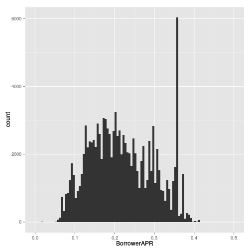 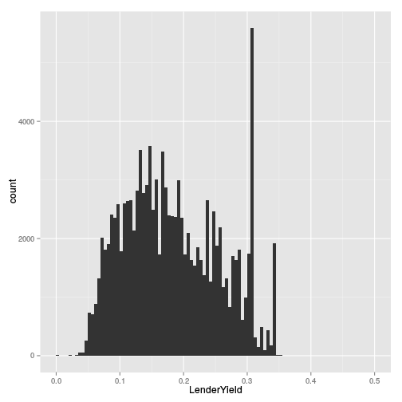 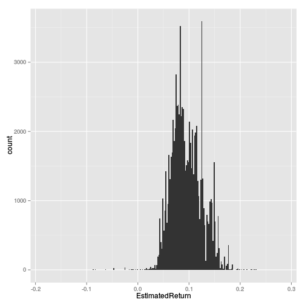 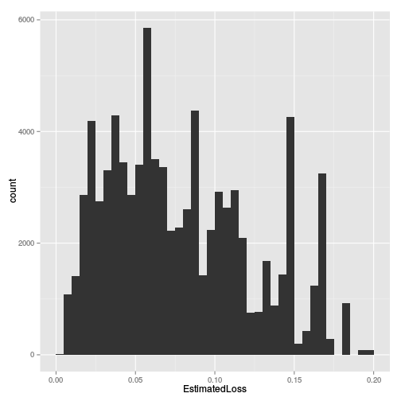 

The distributions of Interest rate look similar in both cases, widely spread.
Lenderers yield is squeezed and shifted to the left relative to the borrower APR.
There is strange peak close to the maximum values. 
The lenders estimated return is also multimodal distribution with strange peaks.

There is a difference between client interest rate (`BorrowerAPR`) and investor interest rate (`LenderYield`). In order to explore the profit for Prosper we create a new variable `ProsperReturn`.


```
##    Min. 1st Qu.  Median    Mean 3rd Qu.    Max.    NA's 
## 0.00069 0.03110 0.03531 0.03610 0.04655 0.15940      25
```

 

The average Prosper profit is 3.6% of all loans per year.
From the histogram it is visible that values are clustered arround several points.

There are only 3 options for loan period - 1, 3 and 5 years:


```
## 
##    12    36    60 
##  1614 87778 24545
```

The following plot will visualize the distribution of the amounts loaned:

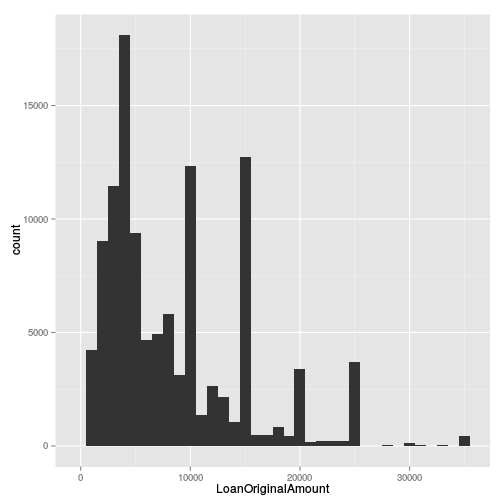 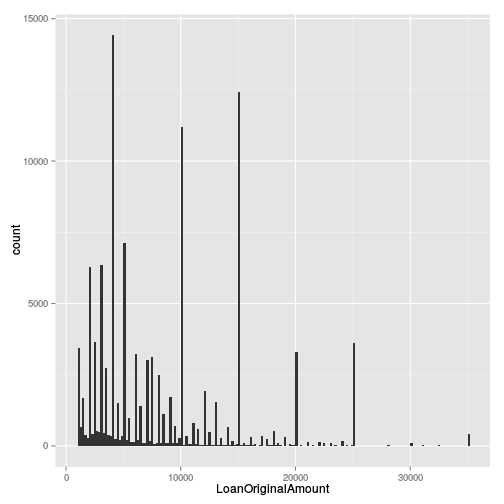 

Loan ammounts in most cases take discrete values, e.g. 4000, 10000, 15000, 20000.
The highest peak is for $4000.

Next we explore the final state or the loan status.
Because there are only few records wih status "Cancelled" we will remove them.
Then "Completed" and "FinalPaymentInProgress" are merged in single level.
Possible states are ordered in a logical way. 
In another variable `LoanStatusShort` all "Past due" above 15 days are merged.


```
##  [1] "Cancelled"              "Chargedoff"            
##  [3] "Completed"              "Current"               
##  [5] "Defaulted"              "FinalPaymentInProgress"
##  [7] "Past Due (1-15 days)"   "Past Due (>120 days)"  
##  [9] "Past Due (16-30 days)"  "Past Due (31-60 days)" 
## [11] "Past Due (61-90 days)"  "Past Due (91-120 days)"
```

```
## [1] 5
```

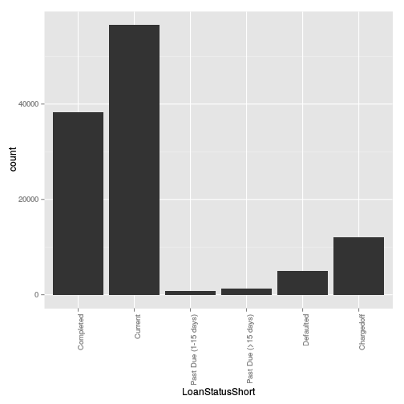 

```
## 
##              Completed                Current   Past Due (1-15 days) 
##                  38279                  56576                    806 
##  Past Due (16-30 days)  Past Due (31-60 days)  Past Due (61-90 days) 
##                    265                    363                    313 
## Past Due (91-120 days)   Past Due (>120 days)              Defaulted 
##                    304                     16                   5018 
##             Chargedoff 
##                  11992
```

```
## 
##            Completed              Current Past Due (1-15 days) 
##                38279                56576                  806 
##  Past Due (>15 days)            Defaulted           Chargedoff 
##                 1261                 5018                11992
```

We can see that most loans from our dataset are still current.
In order to get idea for the risk of failed payments we will consider only the loans that should have been completed:

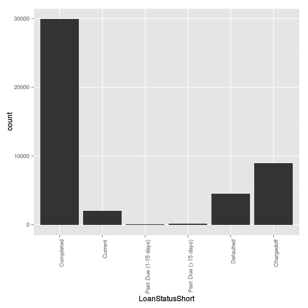 

```
## 
##            Completed              Current Past Due (1-15 days) 
##           65.6511822            4.3711892            0.1798482 
##  Past Due (>15 days)            Defaulted           Chargedoff 
##            0.2412598            9.9245515           19.6319691
```

*About 65.6% of past loans are completed on time.* The rest are charged-off, defaulted or extended (still current).

The number of Prosper loans by year is as follows:


```
## 
##  2005  2006  2007  2008  2009  2010  2011  2012  2013  2014 
##    22  5902 11460 11551  2047  5652 11228 19553 34345 12172
```

Most of the loans are still to be completed (these are loans for which the planned completion date is after the last dataset update date):


```r
table(loans$PlannedClosing > last_updated)
```

```
## 
## FALSE  TRUE 
## 45649 68283
```

The risk of the loan is expressed as Prosper Rating:

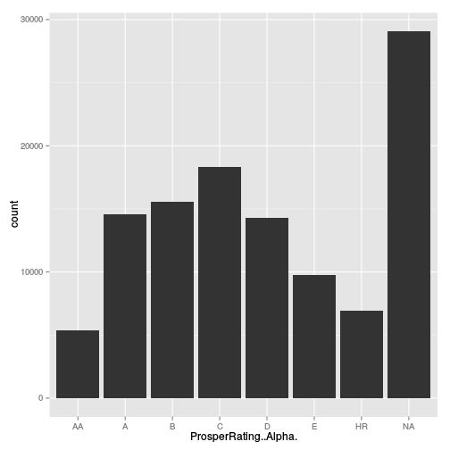 

Another measure of the risk is Prosper Score:

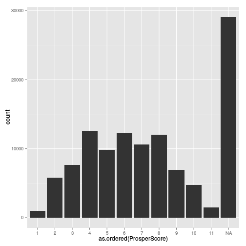 

and credit score:

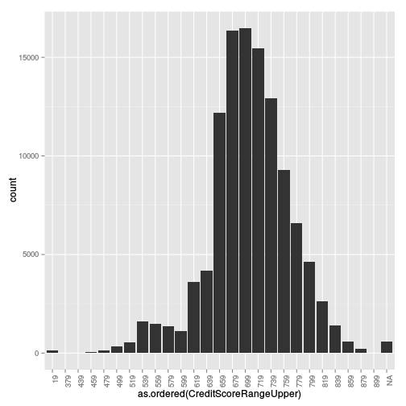 

Debt to income ratio is:

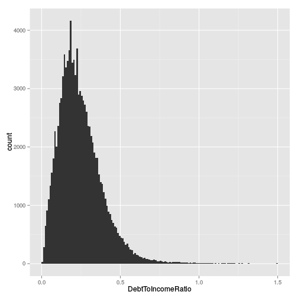 

```
## Warning in scale$trans$trans(x): NaNs produced
```

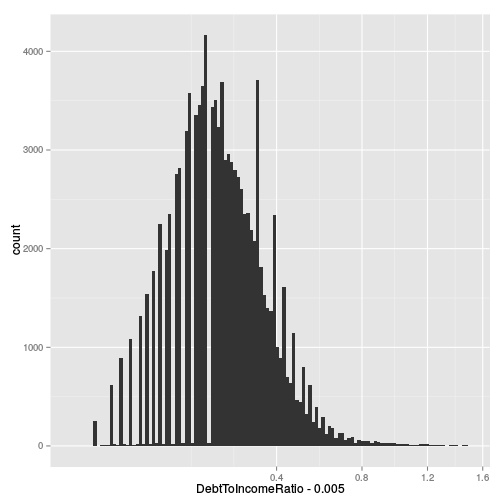 

```
## 
## 0.18 0.22 0.17 0.14  0.2 0.16 0.19 0.15 0.21 0.13 
## 4132 3687 3616 3553 3481 3442 3392 3338 3226 3169
```

It looks nearly normally distributed on square axes x.

# Univariate Analysis

### What is the structure of your dataset?
  There are 113932 loans in the dataset with 81 features, including loan amount, borrower rate (or interest rate), current loan status, borrower income, borrower employment status, borrower credit history, and the latest payment information. More information on variables in the data set is available at [Prosper website](https://www.prosper.com/) Dataset is last updated on 03/11/2014.

### What is/are the main feature(s) of interest in your dataset?

The main features for the loans dataset are as follows:

 - `BorrowerAPR` - the cost of credit as a yearly rate for the borrower.
 The borrower's interest rate plus closing fee distrubuted in time;
 - `LenderYield` - The Lender yield on the loan. 
 The borrower's interest rate less the lender servicing fee.
 - `EstimatedReturn` $\approx LenderYield - EstimatedLoss$ [Estimated Loss Rates](https://www.prosper.com/help/topics/general-estimated_loss_rates/)
 - `LoanStatus` - The current status of the loan.
 Past data about the possible final states *completed* and *charged of*
 could be used to calculate actual loss rates.

### What other features in the dataset do you think will help support your investigation into your feature(s) of interest?

These are some of features that determine the main features
or give details about the loan.

 - `LoanOriginalAmount` - The origination amount of the loan.
 - `Term` - The length of the loan expressed in months.
 - `ClosedDate` - Closed date is applicable for Cancelled, Completed, Chargedoff and Defaulted loan statuses.
 - `ProsperRating..Alpha.`, `ProsperScore`, `CreditScoreRangeLower`,
  `CreditScoreRangeUpper`: Used to calculate Estimated Loss
 - `DelinquenciesLast7Years` - The number of times the borrower has been more than 90 days late with a payment.
 - `DebtToIncomeRatio` - he sum of the borrower's monthly debt payments divided by the borrower's monthly income.
 - `IncomeRange`, `StatedMonthlyIncome` - yearly income group and monthly income.
 - `IsBorrowerHomeowner`
 - `EmploymentStatus`, `EmploymentStatusDuration`
 
These variables are of different types, e.g. date (`LoanOriginationDate`), 
ordered factors (`ProsperRating..Alpha.`, `IncomeRange`), categorical factor (`EmploymentStatus`, `LoanStatus`, `Occupation`), binary (`IsBorrowerHomeowner`). There are also sparse variables (mostly zeroes): `Recommendations`.

### Did you create any new variables from existing variables in the dataset?

In order to estimate Prosper yield I created
$ProsperYield = BorrowerAPR - LenderYield$

To explore the changes of the main variables in time I converted `LoanOriginalAmount` to date type and then extracted the year as new variable
`loans$Year`.

The planned closing date was estimated as a sum of date of loan start and loan duration. It is used to subset only past loans that should be closed.

### Of the features you investigated, were there any unusual distributions? Did you perform any operations on the data to tidy, adjust, or change the form of the data? If so, why did you do this?

On Prosper profit histogram the values are clustered arround several points. 

There is a strange peak in Interest rate histograms.

Prosper rating and Prosper score have quite a few missing values.

Date strings were converted to dates so they can be properly plotted, subtracted and compared. Some categorical variables were converted to ordered factors for better plotting.

`LoanStatus` was modified to so that "FinalPaymentInProgress" is replaced by "Completed". Records with `LoanStatus` equal to "Canceled" were removed from the dataset, as not important for the analysis.

# Bivariate Plots Section

We can review the linear relationship between numerical variables:


```
##                          BorrowerAPR BorrowerRate LenderYield
## BorrowerAPR               1.00000000   0.98982516  0.98933059
## BorrowerRate              0.98982516   1.00000000  0.99921140
## LenderYield               0.98933059   0.99921140  1.00000000
## EstimatedLoss             0.94953750   0.94529698  0.94530836
## EstimatedReturn           0.79427520   0.81766987  0.81765407
## ProsperScore             -0.66828720  -0.64973614 -0.64978347
## EmploymentStatusDuration -0.00859336  -0.01991508 -0.01896211
## CreditScoreRangeLower    -0.42971905  -0.46157312 -0.45435242
## CreditScoreRangeUpper    -0.42971905  -0.46157312 -0.45435242
## DelinquenciesLast7Years   0.16222249   0.17027647  0.16799777
## DebtToIncomeRatio         0.05633133   0.06292314  0.06194961
## StatedMonthlyIncome      -0.08233918  -0.08898236 -0.08820745
## LoanOriginalAmount       -0.32290338  -0.32897643 -0.32846928
## MonthlyLoanPayment       -0.22666716  -0.24475674 -0.24422614
## Year                      0.06488217  -0.02877050 -0.02769339
## ProsperReturn             0.52256948   0.40050505  0.39278087
##                          EstimatedLoss EstimatedReturn ProsperScore
## BorrowerAPR                 0.94953750      0.79427520 -0.668287197
## BorrowerRate                0.94529698      0.81766987 -0.649736144
## LenderYield                 0.94530836      0.81765407 -0.649783473
## EstimatedLoss               1.00000000      0.59105567 -0.673726990
## EstimatedReturn             0.59105567      1.00000000 -0.383210592
## ProsperScore               -0.67372699     -0.38321059  1.000000000
## EmploymentStatusDuration   -0.03916047     -0.03648651 -0.007302109
## CreditScoreRangeLower      -0.51126282     -0.34623273  0.369603047
## CreditScoreRangeUpper      -0.51126282     -0.34623273  0.369603047
## DelinquenciesLast7Years     0.14390563      0.09443582 -0.097754738
## DebtToIncomeRatio           0.12611550      0.08723617 -0.145335892
## StatedMonthlyIncome        -0.08925850     -0.07501281  0.083756653
## LoanOriginalAmount         -0.42989040     -0.28611751  0.266293336
## MonthlyLoanPayment         -0.32870274     -0.25273127  0.175424879
## Year                       -0.20819220     -0.37647287 -0.169729188
## ProsperReturn               0.51457769      0.23663444 -0.473959705
##                          EmploymentStatusDuration CreditScoreRangeLower
## BorrowerAPR                          -0.008593360           -0.42971905
## BorrowerRate                         -0.019915084           -0.46157312
## LenderYield                          -0.018962110           -0.45435242
## EstimatedLoss                        -0.039160473           -0.51126282
## EstimatedReturn                      -0.036486506           -0.34623273
## ProsperScore                         -0.007302109            0.36960305
## EmploymentStatusDuration              1.000000000            0.08113775
## CreditScoreRangeLower                 0.081137748            1.00000000
## CreditScoreRangeUpper                 0.081137748            1.00000000
## DelinquenciesLast7Years               0.012220125           -0.25122258
## DebtToIncomeRatio                    -0.011608411           -0.01319115
## StatedMonthlyIncome                   0.069827805            0.10788271
## LoanOriginalAmount                    0.098142303            0.34084904
## MonthlyLoanPayment                    0.081152542            0.29250135
## Year                                  0.168495113            0.33364308
## ProsperReturn                         0.060590672           -0.05340718
##                          CreditScoreRangeUpper DelinquenciesLast7Years
## BorrowerAPR                        -0.42971905              0.16222249
## BorrowerRate                       -0.46157312              0.17027647
## LenderYield                        -0.45435242              0.16799777
## EstimatedLoss                      -0.51126282              0.14390563
## EstimatedReturn                    -0.34623273              0.09443582
## ProsperScore                        0.36960305             -0.09775474
## EmploymentStatusDuration            0.08113775              0.01222013
## CreditScoreRangeLower               1.00000000             -0.25122258
## CreditScoreRangeUpper               1.00000000             -0.25122258
## DelinquenciesLast7Years            -0.25122258              1.00000000
## DebtToIncomeRatio                  -0.01319115             -0.04387708
## StatedMonthlyIncome                 0.10788271             -0.02580636
## LoanOriginalAmount                  0.34084904             -0.13667279
## MonthlyLoanPayment                  0.29250135             -0.12125278
## Year                                0.33364308             -0.08304944
## ProsperReturn                      -0.05340718              0.04102281
##                          DebtToIncomeRatio StatedMonthlyIncome
## BorrowerAPR                    0.056331332        -0.082339182
## BorrowerRate                   0.062923138        -0.088982364
## LenderYield                    0.061949612        -0.088207454
## EstimatedLoss                  0.126115503        -0.089258503
## EstimatedReturn                0.087236166        -0.075012815
## ProsperScore                  -0.145335892         0.083756653
## EmploymentStatusDuration      -0.011608411         0.069827805
## CreditScoreRangeLower         -0.013191145         0.107882708
## CreditScoreRangeUpper         -0.013191145         0.107882708
## DelinquenciesLast7Years       -0.043877077        -0.025806361
## DebtToIncomeRatio              1.000000000        -0.122667527
## StatedMonthlyIncome           -0.122667527         1.000000000
## LoanOriginalAmount             0.010102221         0.201245819
## MonthlyLoanPayment             0.027588782         0.196816155
## Year                          -0.044196692         0.080847424
## ProsperReturn                 -0.006624287        -0.004232326
##                          LoanOriginalAmount MonthlyLoanPayment        Year
## BorrowerAPR                     -0.32290338      -0.2266671612  0.06488217
## BorrowerRate                    -0.32897643      -0.2447567413 -0.02877050
## LenderYield                     -0.32846928      -0.2442261368 -0.02769339
## EstimatedLoss                   -0.42989040      -0.3287027419 -0.20819220
## EstimatedReturn                 -0.28611751      -0.2527312679 -0.37647287
## ProsperScore                     0.26629334       0.1754248787 -0.16972919
## EmploymentStatusDuration         0.09814230       0.0811525418  0.16849511
## CreditScoreRangeLower            0.34084904       0.2925013466  0.33364308
## CreditScoreRangeUpper            0.34084904       0.2925013466  0.33364308
## DelinquenciesLast7Years         -0.13667279      -0.1212527803 -0.08304944
## DebtToIncomeRatio                0.01010222       0.0275887822 -0.04419669
## StatedMonthlyIncome              0.20124582       0.1968161546  0.08084742
## LoanOriginalAmount               1.00000000       0.9319801778  0.31068458
## MonthlyLoanPayment               0.93198018       1.0000000000  0.25812364
## Year                             0.31068458       0.2581236399  1.00000000
## ProsperReturn                   -0.11404694       0.0005283696  0.57588654
##                          ProsperReturn
## BorrowerAPR               0.5225694781
## BorrowerRate              0.4005050528
## LenderYield               0.3927808695
## EstimatedLoss             0.5145776863
## EstimatedReturn           0.2366344355
## ProsperScore             -0.4739597052
## EmploymentStatusDuration  0.0605906718
## CreditScoreRangeLower    -0.0534071846
## CreditScoreRangeUpper    -0.0534071846
## DelinquenciesLast7Years   0.0410228051
## DebtToIncomeRatio        -0.0066242871
## StatedMonthlyIncome      -0.0042323257
## LoanOriginalAmount       -0.1140469395
## MonthlyLoanPayment        0.0005283696
## Year                      0.5758865395
## ProsperReturn             1.0000000000
```

```
## [1] 0.8745126
```

Some of the variables have subtle differences, e.g. `BorrowerAPR`, `BorrowerRate`, `LenderYield` (corr. coef 0.99). In other cases stronger correlation shows important connections: `BorrowerAPR` is linked to `ProsperScore` (-0.67) and `CreditScoreRangeLower` (-0.43).

The relationship between Loan status and close date:


```
##                         
##                          FALSE  TRUE
##   Completed                205 38074
##   Current                56576     0
##   Past Due (1-15 days)     806     0
##   Past Due (16-30 days)    265     0
##   Past Due (31-60 days)    363     0
##   Past Due (61-90 days)    313     0
##   Past Due (91-120 days)   304     0
##   Past Due (>120 days)      16     0
##   Defaulted                  0  5018
##   Chargedoff                 0 11992
```

Close date is available for Completed, Chargedoff and Defaulted loans.

I would like to calculate the actual loss rate of past loans.
I will start by exploring available risk indicators.
The next explanation is quotation from Prosper website:

> The estimated loss rate is based on the historical performance of Prosper loans with similar characteristics. The estimated base loss rate is determined by two scores: (1) the borrower's credit score, obtained from an official credit reporting agency, and (2) the Prosper Score, figured in-house based on the Prosper population. These two scores determine the base loss rate for each listing. Adjustments can then be made to the base loss rate for the presence of a previous Prosper loan and for certain loan terms. Any adjustments are added to the base loss rate to get the final loss rate, which then determines the Prosper Rating.

So, Prosper rating and Prosper score are related:


```
##     
##        AA    A    B    C    D    E   HR
##   1     0    2    3   21   49  552  365
##   2     0    6   61  490 1255 2692 1262
##   3     4   53  367 1711 2295 1750 1462
##   4    14  285 1451 4738 2506 1681 1920
##   5    11  608 1695 2642 1940 1262 1655
##   6    94 1392 2968 2900 3256 1438  230
##   7   164 2050 2624 3370 2251  118   20
##   8   718 4170 4781 1482  679  214    9
##   9   983 4070  968  770   36   75    9
##   10 2645 1394  492  196    7   13    3
##   11  739  521  171   25    0    0    0
```

```
## Warning: Removed 29079 rows containing non-finite values (stat_boxplot).
```

```
## Warning: Removed 29079 rows containing missing values (geom_point).
```

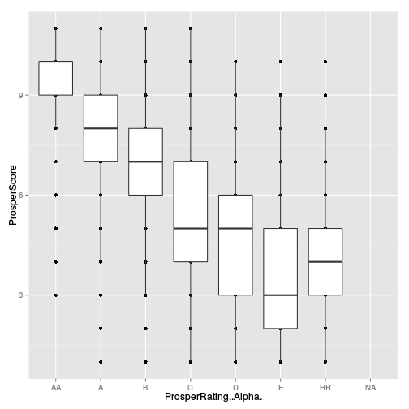 

It is strange that the worst Prosper rating does not have the lowest Prosper scores.

The Prosper rating vs Year:

```
##       
##          AA    A    B    C    D    E   HR
##   2005    0    0    0    0    0    0    0
##   2006    0    0    0    0    0    0    0
##   2007    0    0    0    0    0    0    0
##   2008    0    0    0    0    0    0    0
##   2009  297  458   98  390  333  193  207
##   2010  639  963  536  594 1311  630  906
##   2011  551 1479 1610  888 3273 2306 1121
##   2012 1076 2760 3071 3891 3222 1904 3629
##   2013 1721 5943 7558 9223 5017 3914  969
##   2014 1088 2948 2708 3359 1118  848  103
```

```
##       
##        FALSE  TRUE
##   2005     0    22
##   2006     0  5902
##   2007     0 11460
##   2008     0 11551
##   2009  1976    71
##   2010  5579    73
##   2011 11228     0
##   2012 19553     0
##   2013 34345     0
##   2014 12172     0
```

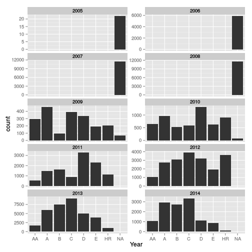 

Prosper rating is introduced in 2009. 
Starting from 2011 all records have assigned Prosper rating.
Comparing the distributions of loans by Prosper rating for early years
and last years we see that they are quite different (flat vs "bell" shape).
Therefore our conclusions based on past data will not be very representative
of the current situation.

Separate subset of past loans but without missing ProsperRating is created.


```
## [1] 16515
```

The link between "EstimatedLoss" and "ProsperRating..Alpha." is visualized:

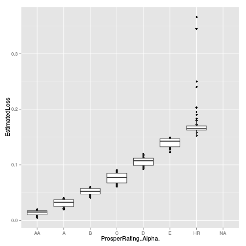 

```
## [1] "Correlation between estimated loss and Prosper rating:"
```

```
## [1] 0.9641819
```

```
## [1] "Correlation between estimated loss and Prosper rating for past loans:"
```

```
## [1] 0.9396867
```

It is quite straitforward. Only "HR" rating has quite dispersed values.

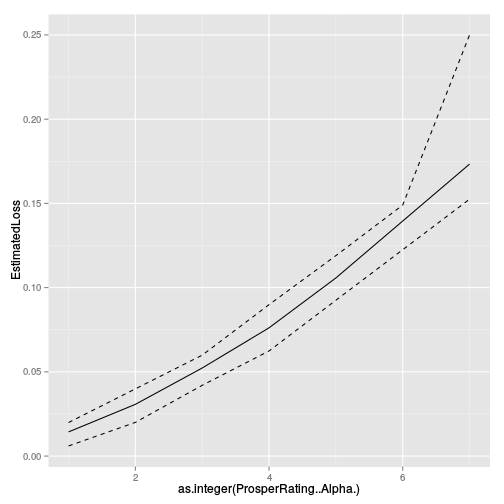 

If we compare the loan closing date with the planned closing we will be surprised:
We have early repayment in 76% of all cases:


```
## 
##     FALSE      TRUE 
## 0.2338358 0.7608088
```

```
## Warning: Removed 205 rows containing missing values (geom_point).
```

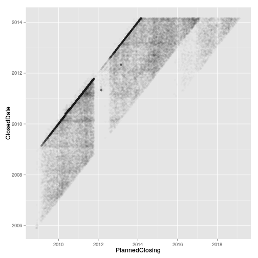 

The link between Prosper Rating and Loan status will be explored for past loans.


```
##                      IsCompleted
## ProsperRating..Alpha. FALSE TRUE
##                    AA   125 1293
##                    A    514 2012
##                    B    474 1318
##                    C    443 1425
##                    D   1401 2671
##                    E   1275 1633
##                    HR   760 1171
```

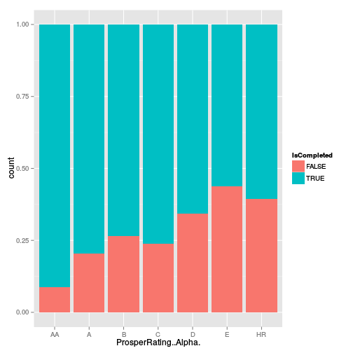 

The performance of loans with rating "A", "B" and "C" look very similar.
Loans "D", "E" and "HR" are also similar considering completion status,
with rating "HR" having higher completion ratio than "E".

This can imply that borrowers with Prosper rating "C" should be prefered against "A", "B" and that "HR"  are better than "D", "E". Further exploration considering the actual amount lost for uncompleted loans worth exploration.

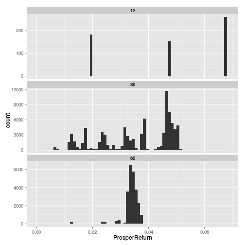 

Prosper return is lower and less dispersed for longer duration loans.

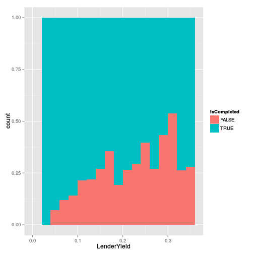 

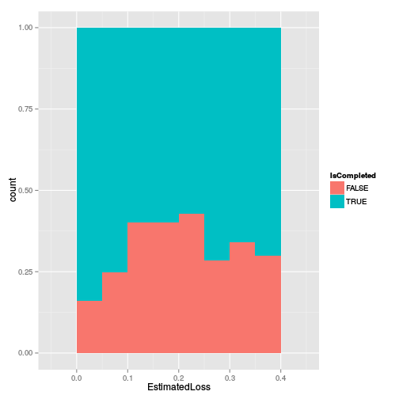 

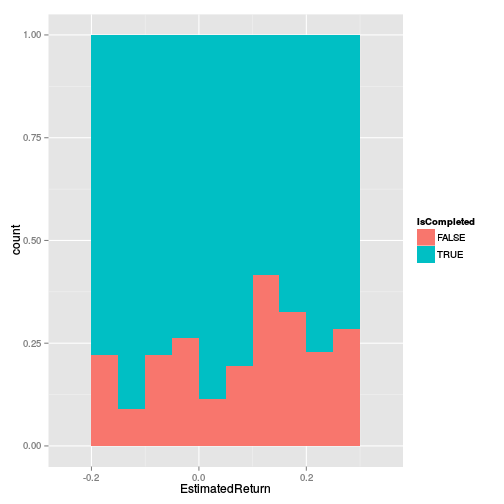 

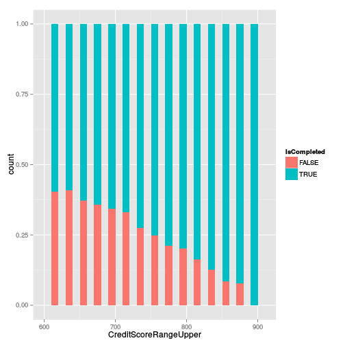 

```
## [1] 0.2408804
```

```
## [1] -0.1920841
```

The relationship of completed loans with credit score is much smooter than with Lender Yield and Estimated Loss. Therefore other factors except from risk level shape the interest rate for the lender. This means also that Credit Score is better measure for borrower reliability than the Estimated Loss.


```
## Warning: Removed 29079 rows containing missing values (stat_summary).
```

```
## Warning: Removed 29079 rows containing missing values (geom_point).
```

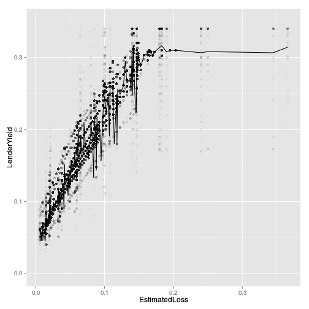 

```
## Warning: Removed 29274 rows containing missing values (stat_summary).
```

```
## Warning: Removed 29275 rows containing missing values (geom_point).
```

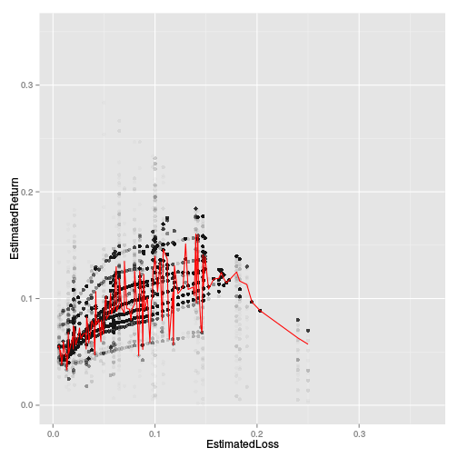 

Next, changes in lender yield are cosidered in time:

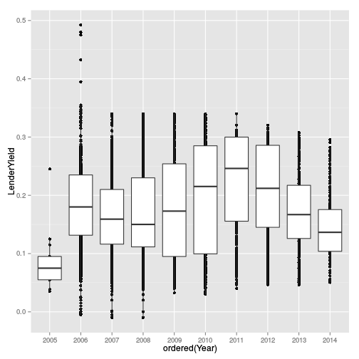 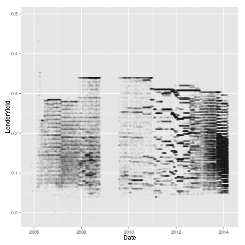 

In last four years (2011 to 2014) there is continuous reduction in lenders yield.
Also, lander yield looks quite different in different years. The period of no Prosper activity is also visible.


```
## Warning: Removed 25 rows containing non-finite values (stat_boxplot).
```

```
## Warning: Removed 25 rows containing missing values (geom_point).
```

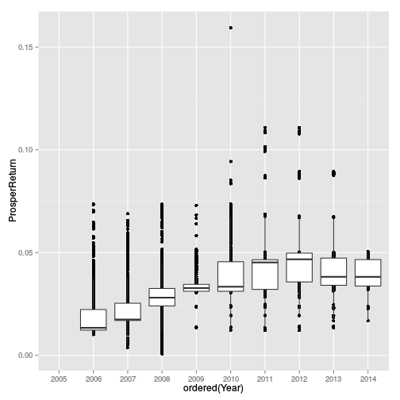 

At the same time Prosper profit is quite stable.

Looking at the return based on loan original amount does not reveal interesting insights.


```
## geom_smooth: method="auto" and size of largest group is >=1000, so using gam with formula: y ~ s(x, bs = "cs"). Use 'method = x' to change the smoothing method.
```

```
## Warning: Removed 29079 rows containing missing values (stat_smooth).
```

```
## Warning: Removed 29079 rows containing missing values (geom_point).
```

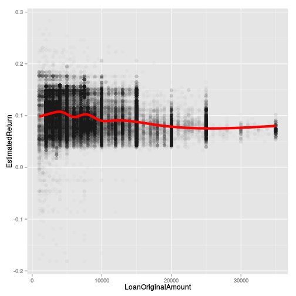 

There are more loans of small amounts and higher dispersion of the return.


# Bivariate Analysis

### Talk about some of the relationships you observed in this part of the investigation. How did the feature(s) of interest vary with other features in the dataset?

We concluded that estimated loss is closely related to Prosper Rating.

The relationship between the proportion of completed loans and Credit Score is stronger than to Prosper Rating or Estimated Loss.

Estimated return is related to estimated loss. The relationship is not linear and there is optimal estimated loss for maximal return.

### Did you observe any interesting relationships between the other features (not the main feature(s) of interest)?

The most interesting insight is that big part (76%) of the completed loans are repayed in advance, before the planned closing date.

### What was the strongest relationship you found?

Correlation between estimated loss and Prosper rating: 0.96.


# Multivariate Plots Section

Lender Yield and Return are presented on the same plot so that the effect on the profit of higher risk loans with higher interest is clear. Only the mean value and 0.05, 0.5 and 0.95 quantiles will be presented to show the general trend and uncertainty level.

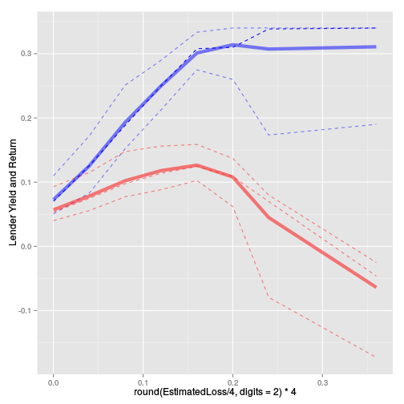 

There is optimum between losses 0.1 and 0.2. At higher losses there is jump in uncertainty.

Next, changes in lender yield are considered in time:

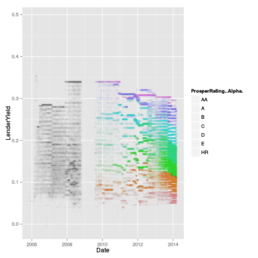 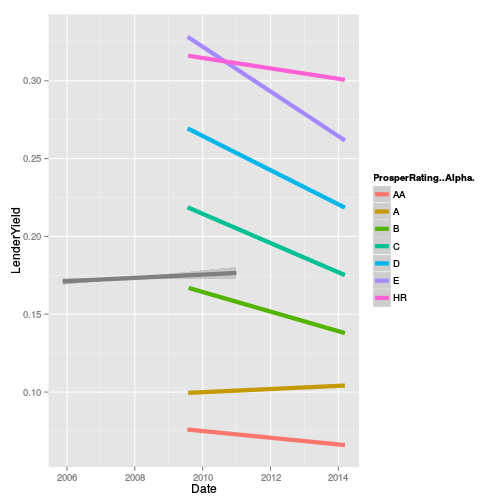 

The same for prosper return:


```
## Warning: Removed 25 rows containing missing values (geom_point).
```

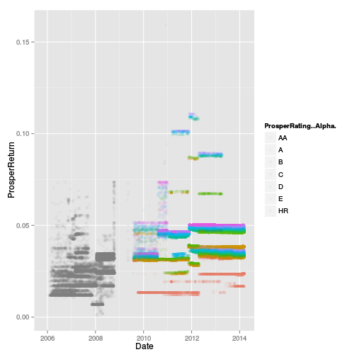 

```
## Warning: Removed 25 rows containing missing values (stat_smooth).
```

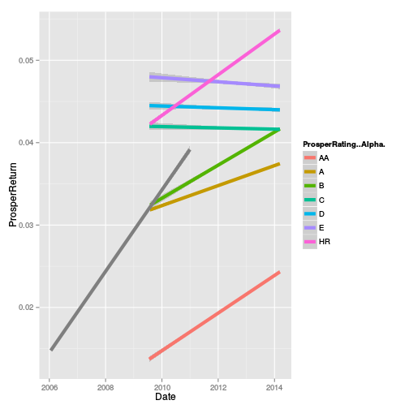 


```
## Warning: Removed 4162 rows containing missing values (geom_point).
```

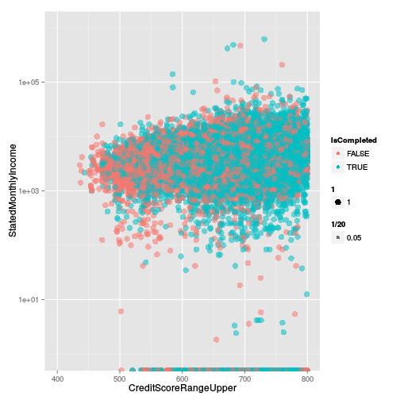 

The relationship between monthly income, credit score and isCompleted - nothing special!

# Multivariate Analysis

### Talk about some of the relationships you observed in this part of the investigation. Were there features that strengthened each other in terms of looking at your feature(s) of interest?

Lender Yield and Return are presented on the same plot as a function of estimated loss. Above losses 0.2 lender yield stop to increase and lender return drops sharply. At higher losses there is jump in uncertainty.

Lenders Yield is reduced in years. This become more clear when loans are divided by Prosper rating. On the contrary, Prosper Return is increasing.

### Were there any interesting or surprising interactions between features?

Several different periods in Prosper loan data can be identified with jump change of loan properties (e.g. see LendersYield vs Date). Therefore most of the conclusion in this report should be treated with causion.

### OPTIONAL: Did you create any models with your dataset? Discuss the strengths and limitations of your model.

A model exploring how different features influence `IsCompleted` variable for past loans can be used to fine tune risk measure variables (e.g. `ProsperRating`).

------

# Final Plots and Summary

### Plot One - the link between Prosper Rating and Loan status for past loans

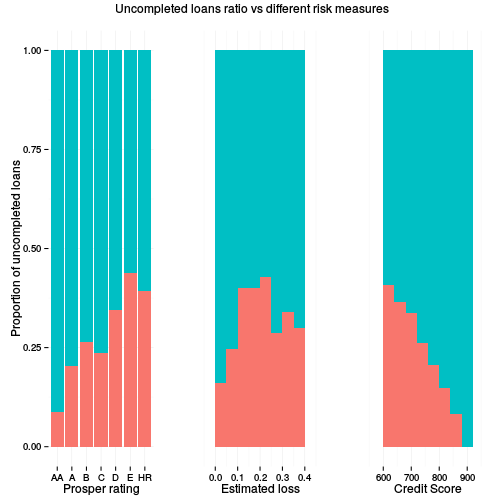 

### Description One

Based on past loans we calculate the proportion of uncompleted loans based on different risk measures - Prosper Rating, Estimated losses and Credit Score. 

The relationship of completed loans with credit score is much smooter than with Lender Yield and Estimated Loss. Looks like Credit Score is better measure for borrower reliability than the Estimated Loss and Prosper Rating.

Prosper rating is important because it determines the Interest rate. 
The performance of loans with rating "A", "B" and "C" look very similar. 
Loans "D", "E" and "HR" are also similar considering completion status,
with rating "HR" having higher completion ratio than "E".
This can imply that borrowers with Prosper rating "C" should be prefered against "A", "B" and that "HR"  are better than "D", "E".

Further exploration considering the actual amount lost for uncompleted loans worth exploration.


### Plot Two
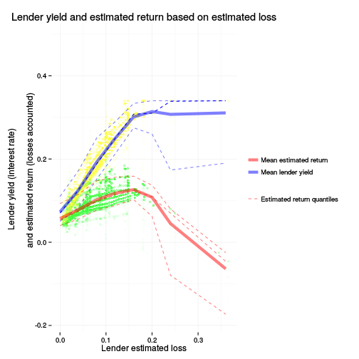 

### Description Two

Both lender yield (interest rate) and return are presented as a function of lender estimated loss. Because at the same estimated loss different interests are possible, mean value and [0.05, 0.5, 0.95] quantiles are presented.

Up to 15% loss both yield and return are increasing. Then yield become constant but the return start to drop. Therefore, there is a kind of optimal risk acceptance level for highest profit. Both low and high losses have low return, but high losses can lead even to negative return.

Uncertainty become much higher at estimate loss above 25%. There is wide margine in negative direction.

### Plot Three

```
## Warning: Removed 205 rows containing missing values (geom_point).
```

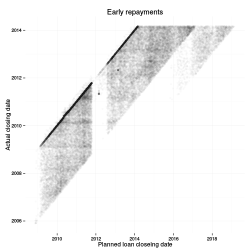 

### Description Three

Early repayment is typical situation.
All points below the diagonal bolder line are preliminary payments.
------

# Reflection

Two datasets were used for this analysis. One is the original full dataset. It is used to calculate the relationship between the primary parameters, like lenders return vs estimated loss.

The other dataset containes only past records that should have expired. For this past data we have the information whether the loan have been completed (or Chargedoff-ed). It is used to check the effectiveness of different risk measures. We noticed that 35% the past loans have not been completed in terms. The best measure of the risk is Credit Score. Prosper ratings "C" and "HR" should be preferred for lenders with lower and higher tolerance to risk. 

It will be usefull to continue the exploration by calculating what part of the total amount is lost for uncompleted loans and how it differes for different borrower categories.

The biggest problem  was that the main feature of interest - the actual return is not available and should be estimated somehow. This is complicated by the enormous number of features. Specialized feature selection algorithms could be important to guide the analysis.

NOTE: Our conclusions are based on past data and will not be very representative of the current situation because the Prosper system is changing in years.

Working with dates created some technical difficulties. Some methods and operations result into POSIXlt date, other in POSIXct. Trying to compare them throws error. Mastering the fine differences between
`strptime`, `strftime`, `as.Date`, `as.POSIXct`, `as.difftime`
could be challenging.

