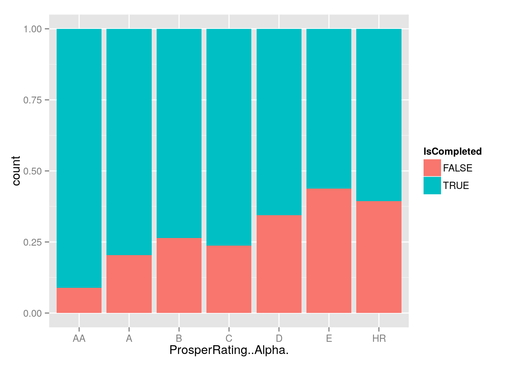
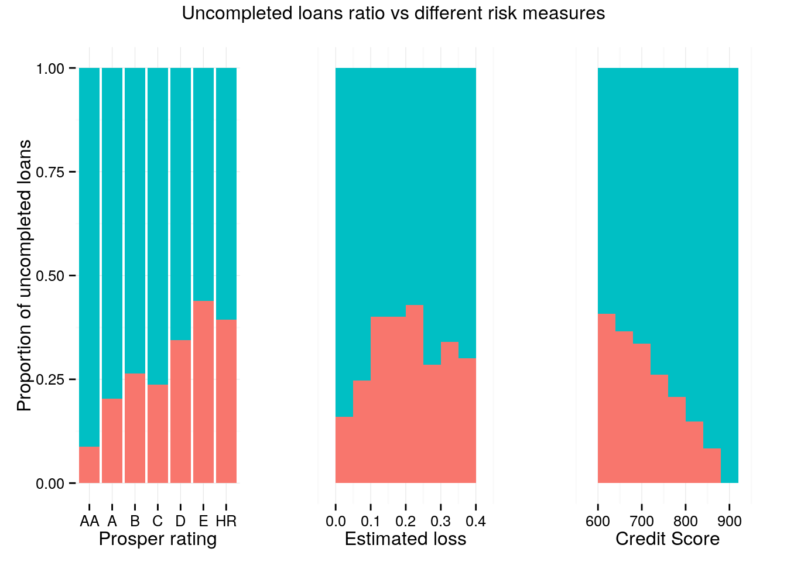
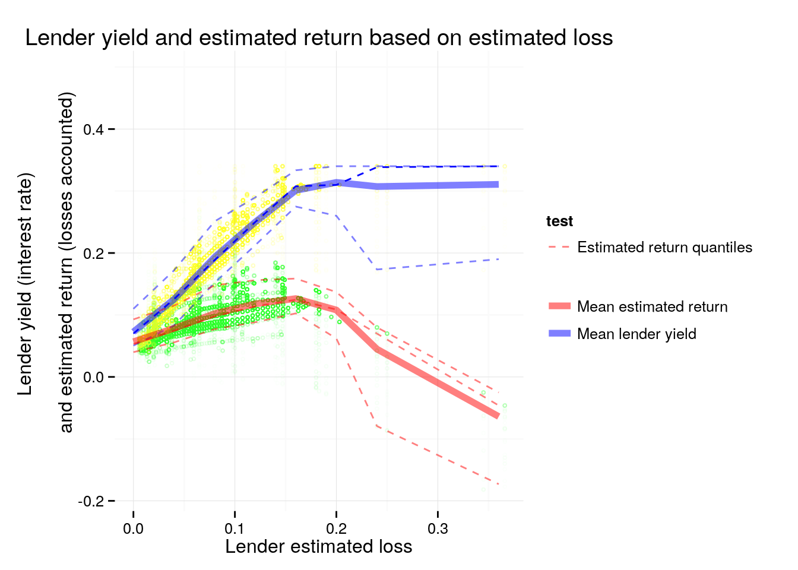

# Univariate Plots Section

| LoanOriginalAmount|LoanStatus | BorrowerAPR| LenderYield| EstimatedLoss|
|------------------:|:----------|-----------:|-----------:|-------------:|
|               9425|Completed  |     0.16516|      0.1380|            NA|
|              10000|Current    |     0.12016|      0.0820|        0.0249|
|               3001|Completed  |     0.28269|      0.2400|            NA|
|              10000|Current    |     0.12528|      0.0874|        0.0249|
|              15000|Current    |     0.24614|      0.1985|        0.0925|
|              15000|Current    |     0.15425|      0.1214|        0.0449|

```
##  [1] "Term"                     "LoanStatus"              
##  [3] "ClosedDate"               "BorrowerAPR"             
##  [5] "BorrowerRate"             "LenderYield"             
##  [7] "EstimatedLoss"            "EstimatedReturn"         
##  [9] "ProsperRating..Alpha."    "ProsperScore"            
## [11] "EmploymentStatus"         "EmploymentStatusDuration"
## [13] "IsBorrowerHomeowner"      "CreditScoreRangeLower"   
## [15] "CreditScoreRangeUpper"    "DelinquenciesLast7Years" 
## [17] "DebtToIncomeRatio"        "IncomeRange"             
## [19] "StatedMonthlyIncome"      "LoanOriginalAmount"      
## [21] "Date"                     "MonthlyLoanPayment"      
## [23] "Recommendations"          "Year"
```

```
##       Term                       LoanStatus   
##  Min.   :12.00   Current              :56576  
##  1st Qu.:36.00   Completed            :38074  
##  Median :36.00   Chargedoff           :11992  
##  Mean   :40.83   Defaulted            : 5018  
##  3rd Qu.:36.00   Past Due (1-15 days) :  806  
##  Max.   :60.00   Past Due (31-60 days):  363  
##                  (Other)              : 1108  
##    ClosedDate                   BorrowerAPR       BorrowerRate   
##  Min.   :2005-11-25 00:00:00   Min.   :0.00653   Min.   :0.0000  
##  1st Qu.:2009-07-14 00:00:00   1st Qu.:0.15629   1st Qu.:0.1340  
##  Median :2011-04-05 00:00:00   Median :0.20976   Median :0.1840  
##  Mean   :2011-03-07 19:48:20   Mean   :0.21883   Mean   :0.1928  
##  3rd Qu.:2013-01-30 00:00:00   3rd Qu.:0.28381   3rd Qu.:0.2500  
##  Max.   :2014-03-10 00:00:00   Max.   :0.51229   Max.   :0.4975  
##  NA's   :58848                 NA's   :25                        
##   LenderYield      EstimatedLoss   EstimatedReturn  ProsperRating..Alpha.
##  Min.   :-0.0100   Min.   :0.005   Min.   :-0.183   C      :18345        
##  1st Qu.: 0.1242   1st Qu.:0.042   1st Qu.: 0.074   B      :15581        
##  Median : 0.1730   Median :0.072   Median : 0.092   A      :14551        
##  Mean   : 0.1827   Mean   :0.080   Mean   : 0.096   D      :14274        
##  3rd Qu.: 0.2400   3rd Qu.:0.112   3rd Qu.: 0.117   E      : 9795        
##  Max.   : 0.4925   Max.   :0.366   Max.   : 0.284   (Other):12307        
##                    NA's   :29084   NA's   :29084    NA's   :29084        
##   ProsperScore        EmploymentStatus EmploymentStatusDuration
##  Min.   : 1.00   Employed     :67322   Min.   :  0.00          
##  1st Qu.: 4.00   Full-time    :26355   1st Qu.: 26.00          
##  Median : 6.00   Self-employed: 6134   Median : 67.00          
##  Mean   : 5.95   Not available: 5347   Mean   : 96.07          
##  3rd Qu.: 8.00   Other        : 3806   3rd Qu.:137.00          
##  Max.   :11.00                : 2255   Max.   :755.00          
##  NA's   :29084   (Other)      : 2718   NA's   :7625            
##  IsBorrowerHomeowner CreditScoreRangeLower CreditScoreRangeUpper
##  False:56459         Min.   :  0.0         Min.   : 19.0        
##  True :57478         1st Qu.:660.0         1st Qu.:679.0        
##                      Median :680.0         Median :699.0        
##                      Mean   :685.6         Mean   :704.6        
##                      3rd Qu.:720.0         3rd Qu.:739.0        
##                      Max.   :880.0         Max.   :899.0        
##                      NA's   :591           NA's   :591          
##  DelinquenciesLast7Years DebtToIncomeRatio         IncomeRange   
##  Min.   : 0.000          Min.   : 0.000    $25,000-49,999:32192  
##  1st Qu.: 0.000          1st Qu.: 0.140    $50,000-74,999:31050  
##  Median : 0.000          Median : 0.220    $100,000+     :17337  
##  Mean   : 4.155          Mean   : 0.276    $75,000-99,999:16916  
##  3rd Qu.: 3.000          3rd Qu.: 0.320    $1-24,999     : 7274  
##  Max.   :99.000          Max.   :10.010    (Other)       : 1427  
##  NA's   :990             NA's   :8554      NA's          : 7741  
##  StatedMonthlyIncome LoanOriginalAmount      Date                    
##  Min.   :      0     Min.   : 1000      Min.   :2005-11-15 00:00:00  
##  1st Qu.:   3200     1st Qu.: 4000      1st Qu.:2008-10-02 00:00:00  
##  Median :   4667     Median : 6500      Median :2012-06-26 00:00:00  
##  Mean   :   5608     Mean   : 8337      Mean   :2011-07-21 03:44:57  
##  3rd Qu.:   6825     3rd Qu.:12000      3rd Qu.:2013-09-18 00:00:00  
##  Max.   :1750003     Max.   :35000      Max.   :2014-03-12 00:00:00  
##                                                                      
##  MonthlyLoanPayment Recommendations         Year     
##  Min.   :   0.0     Min.   : 0.00000   Min.   :2005  
##  1st Qu.: 131.6     1st Qu.: 0.00000   1st Qu.:2008  
##  Median : 217.7     Median : 0.00000   Median :2012  
##  Mean   : 272.5     Mean   : 0.04803   Mean   :2011  
##  3rd Qu.: 371.6     3rd Qu.: 0.00000   3rd Qu.:2013  
##  Max.   :2251.5     Max.   :39.00000   Max.   :2014  
## 
```

Loans vary from $1000 to $35000. The monthly loan payment is from $130 to $2250.

The average cost for the borrower (`BorrowerAPR`) is 21.9%, the average yield for the lender (`LenderYield`) is 18.2%. Considering that the estimated loss for the lender is 8 %, the return is actually 9.6% on average. These numbers vary quite widely - the return can be actually negative (minimal value at -18.3%) and in 50% of all cases is between 7.4% and 11%. So it will be interesting to see the distribution of borrower costs and investors profit. For the borrower the range is 
(0.00653, 0.51229).


```
## [[1]]
```

 

```
## 
## [[2]]
```

 

```
## 
## [[3]]
```

 

```
## 
## [[4]]
```

 

The distributions of Interest rate look similar in both cases, widely spread.
Lenderers yield is squeezed and shifted to the left relative to the borrower APR.
There is strange peak close to the maximum values. 
The lenders estimated return is also multimodal distribution with strange peaks.

There is a difference between client interest rate (`BorrowerAPR`) and investor interest rate (`LenderYield`). In order to explore the profit for Prosper we create a new variable $ProsperReturn = BorrowerAPR - LenderYield$.


```
##    Min. 1st Qu.  Median    Mean 3rd Qu.    Max.    NA's 
## 0.00069 0.03110 0.03531 0.03610 0.04655 0.15940      25
```

 

The average Prosper profit is 3.6% of all loans per year.
From the histogram it is visible that values are clustered arround several points.

There are only 3 options for loan period - 1, 3 and 5 years:


```
## 
##    12    36    60 
##  1614 87778 24545
```

```
## 
##         12         36         60 
## 0.01416572 0.77040821 0.21542607
```
Most of the loans are for 3 years. For 1 year are only 1.4% of all loans.

The following plot will visualize the distribution of the amounts loaned:

  

Loan ammounts in most cases take discrete values, e.g. 4000, 10000, 15000, 20000.
The highest peak is for $4000.

Next we explore the final state or the loan status.
Because there are only few records wih status "Cancelled" we will remove them.
Then "Completed" and "FinalPaymentInProgress" are merged in single level.
Possible states are ordered in a logical way. 
In another variable `LoanStatusShort` all "Past due" above 15 days are merged.


```
##  [1] "Cancelled"              "Chargedoff"            
##  [3] "Completed"              "Current"               
##  [5] "Defaulted"              "FinalPaymentInProgress"
##  [7] "Past Due (1-15 days)"   "Past Due (>120 days)"  
##  [9] "Past Due (16-30 days)"  "Past Due (31-60 days)" 
## [11] "Past Due (61-90 days)"  "Past Due (91-120 days)"
```

```
## [1] 5
```

 

We can see that most loans from our dataset are still current.
In order to get idea for the risk of failed payments we will consider only the loans that should have been completed:

 

```
## 
##            Completed              Current Past Due (1-15 days) 
##           65.6511822            4.3711892            0.1798482 
##  Past Due (>15 days)            Defaulted           Chargedoff 
##            0.2412598            9.9245515           19.6319691
```

*About 65.6% of past loans are completed on time.* The rest are charged-off, defaulted or extended (still current).

The number of Prosper loans by year is as follows:


```
## 
##  2005  2006  2007  2008  2009  2010  2011  2012  2013  2014 
##    22  5902 11460 11551  2047  5652 11228 19553 34345 12172
```

Most of the loans are still to be completed (these are loans for which the planned completion date is after the last dataset update date):


```
## 
## FALSE  TRUE 
## 45649 68283
```

The risk of the loan is expressed as Prosper Rating:

 

Another measure of the risk is Prosper Score:

 

and credit score:

 

Debt to income ratio is:

  

```
## [1] "Highest frequency Debt To Income Ratios:"
```

```
## 
## 0.18 0.22 0.17 0.14  0.2 0.16 0.19 0.15 0.21 0.13 
## 4132 3687 3616 3553 3481 3442 3392 3338 3226 3169
```

It looks nearly normally distributed on square axes x. Most of these ratios are 
below 0.5

# Univariate Analysis

### What is the structure of your dataset?
  There are 113932 loans in the dataset with 81 features, including loan amount, borrower rate (or interest rate), current loan status, borrower income, borrower employment status, borrower credit history, and the latest payment information. More information on variables in the data set is available at [Prosper website](https://www.prosper.com/) Dataset is last updated on 03/11/2014.

### What is/are the main feature(s) of interest in your dataset?

The main features for the loans dataset are as follows:

 - `BorrowerAPR` - the cost of credit as a yearly rate for the borrower.
 The borrower's interest rate plus closing fee distrubuted in time;
 - `LenderYield` - The Lender yield on the loan. 
 The borrower's interest rate less the lender servicing fee.
 - `EstimatedLoss` - Estimated risk for the lender, [Estimated Loss Rates](https://www.prosper.com/help/topics/general-estimated_loss_rates/)
 $EstimatedReturn \approx LenderYield - EstimatedLoss$ 
 - `LoanStatus` - The current status of the loan.
 Past data about the possible final states *completed* and *charged of*
 could be used to calculate actual loss rates.

### What other features in the dataset do you think will help support your investigation into your feature(s) of interest?

These are some of features that determine the main features
or give details about the loan.

 - `LoanOriginalAmount` - The origination amount of the loan.
 - `Term` - The length of the loan expressed in months.
 - `ClosedDate` - Closed date is applicable for Cancelled, Completed, Chargedoff and Defaulted loan statuses.
 - `ProsperRating..Alpha.`, `ProsperScore`, `CreditScoreRangeLower`,
  `CreditScoreRangeUpper`: Used to calculate Estimated Loss
 - `DelinquenciesLast7Years` - The number of times the borrower has been more than 90 days late with a payment.
 - `DebtToIncomeRatio` - he sum of the borrower's monthly debt payments divided by the borrower's monthly income.
 - `IncomeRange`, `StatedMonthlyIncome` - yearly income group and monthly income.
 - `IsBorrowerHomeowner`
 - `EmploymentStatus`, `EmploymentStatusDuration`
 
These variables are of different types, e.g. date (`LoanOriginationDate`), 
ordered factors (`ProsperRating..Alpha.`, `IncomeRange`), categorical factor (`EmploymentStatus`, `LoanStatus`, `Occupation`), binary (`IsBorrowerHomeowner`). There are also sparse variables (mostly zeroes): `Recommendations`.

### Did you create any new variables from existing variables in the dataset?

In order to estimate Prosper yield I created
$ProsperReturn = BorrowerAPR - LenderYield$

To explore the changes of the main variables in time I converted `LoanOriginalAmount` to date type and then extracted the year as new variable
`loans$Year`.

The planned closing date was estimated as a sum of date of loan start and loan duration. It is used to subset only past loans that should be closed.

To esitimate the actuall losses, variable `IsCompleted` will be defined
as logical variable, TRUE if the loan have been successfully completed.

### Of the features you investigated, were there any unusual distributions? Did you perform any operations on the data to tidy, adjust, or change the form of the data? If so, why did you do this?

On Prosper profit histogram the values are clustered arround several points. 

There is a strange peak in Interest rate histograms.

Only 65.6% of past loans are completed on time. The rest are charged-off, defaulted or extended (still current).

Prosper rating and Prosper score have quite a few missing values.

Debt to income ratio distribution is squed on the left. It gets more "normal" shape on square root axes.

Date strings were converted to dates so they can be properly plotted, subtracted and compared. Some categorical variables were converted to ordered factors for better plotting.

`LoanStatus` was modified to so that "FinalPaymentInProgress" is replaced by "Completed". Records with `LoanStatus` equal to "Canceled" were removed from the dataset, as not important for the analysis.

# Bivariate Plots Section

We can review the linear relationship between numerical variables:


|                         | BorrowerAPR| LenderYield| EstimatedLoss| EstimatedReturn| ProsperScore|
|:------------------------|-----------:|-----------:|-------------:|---------------:|------------:|
|BorrowerAPR              |        1.00|        0.99|          0.95|            0.79|        -0.67|
|BorrowerRate             |        0.99|        1.00|          0.95|            0.82|        -0.65|
|LenderYield              |        0.99|        1.00|          0.95|            0.82|        -0.65|
|EstimatedLoss            |        0.95|        0.95|          1.00|            0.59|        -0.67|
|EstimatedReturn          |        0.79|        0.82|          0.59|            1.00|        -0.38|
|ProsperScore             |       -0.67|       -0.65|         -0.67|           -0.38|         1.00|
|EmploymentStatusDuration |       -0.01|       -0.02|         -0.04|           -0.04|        -0.01|
|CreditScoreRangeLower    |       -0.43|       -0.45|         -0.51|           -0.35|         0.37|
|CreditScoreRangeUpper    |       -0.43|       -0.45|         -0.51|           -0.35|         0.37|
|DelinquenciesLast7Years  |        0.16|        0.17|          0.14|            0.09|        -0.10|
|DebtToIncomeRatio        |        0.06|        0.06|          0.13|            0.09|        -0.15|
|StatedMonthlyIncome      |       -0.08|       -0.09|         -0.09|           -0.08|         0.08|
|LoanOriginalAmount       |       -0.32|       -0.33|         -0.43|           -0.29|         0.27|
|MonthlyLoanPayment       |       -0.23|       -0.24|         -0.33|           -0.25|         0.18|
|Year                     |        0.06|       -0.03|         -0.21|           -0.38|        -0.17|
|ProsperReturn            |        0.52|        0.39|          0.51|            0.24|        -0.47|

 

Some of the variables have subtle differences, e.g. `BorrowerAPR`, `BorrowerRate`, `LenderYield` (corr. coef 0.99). In other cases stronger correlation shows important connections: `BorrowerAPR` is linked to `EstimatedLoss` (0.95), and `EstimatedLoss` is linked to `ProsperScore` (-0.67) and `CreditScoreRangeLower` (-0.51).

Next we check loan durations in different years:


```
##       Term
## Year      12    36    60
##   2005     0    22     0
##   2006     0  5902     0
##   2007     0 11460     0
##   2008     0 11551     0
##   2009     0  2047     0
##   2010    13  5608    31
##   2011   547  9651  1030
##   2012   782 12516  6255
##   2013   272 20706 13367
##   2014     0  8310  3862
```

Loans for one and five years are introduced in 2010. 
Before this year only three year loans have been available.

The relationship between Loan status and close date:


```
##                         
##                          FALSE  TRUE
##   Completed                205 38074
##   Current                56576     0
##   Past Due (1-15 days)     806     0
##   Past Due (16-30 days)    265     0
##   Past Due (31-60 days)    363     0
##   Past Due (61-90 days)    313     0
##   Past Due (91-120 days)   304     0
##   Past Due (>120 days)      16     0
##   Defaulted                  0  5018
##   Chargedoff                 0 11992
```

Close date is available for Completed, Chargedoff and Defaulted loans.

I would like to calculate the actual loss rate of past loans.
I will start by exploring available risk indicators.
The next explanation is quotation from Prosper website:

> The estimated loss rate is based on the historical performance of Prosper loans with similar characteristics. The estimated base loss rate is determined by two scores: (1) the borrower's credit score, obtained from an official credit reporting agency, and (2) the Prosper Score, figured in-house based on the Prosper population. These two scores determine the base loss rate for each listing. Adjustments can then be made to the base loss rate for the presence of a previous Prosper loan and for certain loan terms. Any adjustments are added to the base loss rate to get the final loss rate, which then determines the Prosper Rating.

So, Prosper rating and Prosper score are related:


```
##     
##        AA    A    B    C    D    E   HR
##   1     0    2    3   21   49  552  365
##   2     0    6   61  490 1255 2692 1262
##   3     4   53  367 1711 2295 1750 1462
##   4    14  285 1451 4738 2506 1681 1920
##   5    11  608 1695 2642 1940 1262 1655
##   6    94 1392 2968 2900 3256 1438  230
##   7   164 2050 2624 3370 2251  118   20
##   8   718 4170 4781 1482  679  214    9
##   9   983 4070  968  770   36   75    9
##   10 2645 1394  492  196    7   13    3
##   11  739  521  171   25    0    0    0
```

 

It is strange that the worst Prosper rating does not have the lowest Prosper scores.

The Prosper rating vs Year:

 

Prosper rating is introduced in 2009. 
Starting from 2011 all records have assigned Prosper rating.
Comparing the distributions of loans by Prosper rating for early years
and last years we see that they are quite different (flat vs "bell" shape).
Therefore our conclusions based on past data will not be very representative
of the current situation.

Separate subset of past loans but without missing ProsperRating is created.


```
## [1] 16515
```

The link between "EstimatedLoss" and "ProsperRating..Alpha." is visualized:

 

```
## [1] "Correlation between estimated loss and Prosper rating:"
```

```
## [1] 0.9641819
```

```
## [1] "Correlation between estimated loss and Prosper rating for past loans:"
```

```
## [1] 0.9396867
```

It is quite straitforward. Only "HR" rating has quite dispersed values.

 

On the other hand, Credit Score is related to Estimated Loss, but not so strongly:

 

If we compare the loan closing date with the planned closing we will be surprised:
We have early repayment in 76% of all cases:


```
## 
##     FALSE      TRUE 
## 0.2338358 0.7608088
```

 

The link between Prosper Rating and Loan status will be explored for past loans.


```
##                      IsCompleted
## ProsperRating..Alpha. FALSE TRUE
##                    AA   125 1293
##                    A    514 2012
##                    B    474 1318
##                    C    443 1425
##                    D   1401 2671
##                    E   1275 1633
##                    HR   760 1171
```

 

The performance of loans with rating "A", "B" and "C" look very similar.
Loans "D", "E" and "HR" are also similar considering completion status,
with rating "HR" having higher completion ratio than "E".

This can imply that borrowers with Prosper rating "C" should be prefered against "A", "B" and that "HR"  are better than "D", "E". Further exploration considering the actual amount lost for uncompleted loans worth exploration.

 

 

 

 

 

```
## [1] "Correlation between IsCompleted and CreditScoreRangeUpper:"
```

```
## [1] 0.2408804
```

```
## [1] "Correlation between IsCompleted and EstimatedLoss:"
```

```
## [1] -0.1920841
```

```
## [1] "Correlation between IsCompleted and ProsperScore:"
```

```
## [1] 0.2481559
```

The relationship of completed loans with credit score is much smooter than with Lender Yield and Estimated Loss. Therefore other factors except from risk level shape the interest rate for the lender. This means also that Credit Score is better measure for borrower reliability than the Estimated Loss.

How good is `EstimatedLoss` to predict whether the loan will be completed is summarized below:

 

```
## 
## 	Pearson's product-moment correlation
## 
## data:  EstimatedLoss and as.numeric(IsCompleted)
## t = -25.152, df = 16513, p-value < 2.2e-16
## alternative hypothesis: true correlation is not equal to 0
## 95 percent confidence interval:
##  -0.2067300 -0.1773521
## sample estimates:
##        cor 
## -0.1920841
```
There is statistically significant relationship but it is weak - correlation coefficient -0.19.

How `LenderYield` and `EstimatedReturn` vary with `EstimatedLoss` is considered next.

  

The price for higher Lender Yield is accepting higher losses. Estimated return initially increase with increase in losses but then drops.

Next, changes in lender yield are cosidered in time:

  

In last four years (2011 to 2014) there is continuous reduction in lenders yield.
Also, lander yield looks quite different in different years. The period of no Prosper activity is also visible.

 

At the same time Prosper profit is quite stable.

Looking at the return based on loan original amount does not reveal interesting insights.

 

There are more loans of small amounts and higher dispersion of the return.


# Bivariate Analysis

### Talk about some of the relationships you observed in this part of the investigation. How did the feature(s) of interest vary with other features in the dataset?

We concluded that estimated loss is closely related to Prosper Rating.

The relationship between the proportion of completed loans and Credit Score is stronger than to Prosper Rating or Estimated Loss. 

The correlation between whether the loan is completed and Estimated Loss is significant but weak - less then 0.2. This raises question how good is Estimated Loss as a measure or borrower reliability (the probability to complete the loan on time). Is there a combination of features which is a better estimate for borrower reliability?

Estimated return is related to estimated loss. The relationship is not linear and there is optimal estimated loss for maximal return.

### Did you observe any interesting relationships between the other features (not the main feature(s) of interest)?

The most interesting insight is that big part (76%) of the completed loans are repayed in advance, before the planned closing date.

Prosper rating is introduced in 2009 and its distribution varies through the following years. So old data may be are not good for conclusions about the current situation?

Also it worth noting that while lender yield is decreasing in last years we can't say so about Prosper return.

### What was the strongest relationship you found?

Correlation between estimated loss and Prosper rating: 0.96.


# Multivariate Plots Section

Lender Yield and Return are presented on the same plot so that the effect on the profit of higher risk loans with higher interest is clear. Only the mean value and 0.05, 0.5 and 0.95 quantiles will be presented to show the general trend and uncertainty level. They are calculated for smoothed data.

 

There is optimum between losses 0.1 and 0.2. At higher losses there is jump in uncertainty.

Next, changes in lender yield are considered in time, now with account for prosper rating:

  

From the graphs it is clear that Lender Yield decrease in last years. Also, different Prosper rating groups are clearly separated.

The same graphs for Prosper return:

  

Prosper returns look fixed for specific periods with a step change at the beginning of 2012. Varies with Prosper rating and other reasons. The previous conclusion about non-decreasing values in time is confirmed.

Next we try to see the effect over loan successful completion ratio of two best risk measures together, i.e Credit score and Prosper score:

 

On this graph higher Prosper Score have high percent completed. Higher Credit score gives high percent completed with the exception of the cases with very low Prosper Score. This is deviation from the general tendency to have increase of the completion with increase of the risk measure. So Prosper Score definitely worth consideration. May be there are not enough data in this sector so random fluctuations can skew the result? We will try to modivy the graph so that it visualize the number of samples used for calculation of the completion ratio also. 

 

The deviations from the main pattern are related to very few samples.

The relationship between `EstimatedLoss` and other factors is explored graphically:

 

Credit score and Prosper score are related, but there are other factors - there are several groups of points with the same Prosper score and similar Credit score but quite different Estimated loss.

To explore in more details what factors are considered in `EstimatedLoss` we create a linear model:


```
## 
## Calls:
## m1: lm(formula = I(log10(EstimatedLoss)) ~ ProsperScore, data = loans)
## m2: lm(formula = I(log10(EstimatedLoss)) ~ ProsperScore + IsBorrowerHomeowner, 
##     data = loans)
## m3: lm(formula = I(log10(EstimatedLoss)) ~ ProsperScore + IsBorrowerHomeowner + 
##     EmploymentStatus, data = loans)
## m4: lm(formula = I(log10(EstimatedLoss)) ~ ProsperScore + IsBorrowerHomeowner + 
##     EmploymentStatus + Year, data = loans)
## m5: lm(formula = I(log10(EstimatedLoss)) ~ ProsperScore + IsBorrowerHomeowner + 
##     EmploymentStatus + Year + CreditScoreRangeUpper, data = loans)
## 
## ================================================================================================
##                                               m1         m2         m3         m4         m5    
## ------------------------------------------------------------------------------------------------
## (Intercept)                               -0.648***  -0.620***  -0.613***  150.568*** 159.454***
##                                           (0.002)    (0.002)    (0.002)     (1.360)    (1.166)  
## ProsperScore                              -0.090***  -0.089***  -0.091***   -0.094***  -0.077***
##                                           (0.000)    (0.000)    (0.000)     (0.000)    (0.000)  
## IsBorrowerHomeowner: True/False                      -0.061***  -0.061***   -0.057***   0.002   
##                                                      (0.001)    (0.001)     (0.001)    (0.001)  
## EmploymentStatus: Full-time/Employed                             0.033***   -0.132***  -0.163***
##                                                                 (0.003)     (0.003)    (0.002)  
## EmploymentStatus: Not employed/Employed                          0.139***    0.063***   0.098***
##                                                                 (0.008)     (0.008)    (0.007)  
## EmploymentStatus: Other/Employed                                 0.010**     0.013***   0.022***
##                                                                 (0.003)     (0.003)    (0.003)  
## EmploymentStatus: Part-time/Employed                             0.060***   -0.123***  -0.153***
##                                                                 (0.013)     (0.012)    (0.011)  
## EmploymentStatus: Retired/Employed                               0.054***   -0.088***  -0.091***
##                                                                 (0.011)     (0.010)    (0.009)  
## EmploymentStatus: Self-employed/Employed                        -0.070***   -0.085***  -0.036***
##                                                                 (0.003)     (0.003)    (0.003)  
## Year                                                                        -0.075***  -0.079***
##                                                                             (0.001)    (0.001)  
## CreditScoreRangeUpper                                                                  -0.002***
##                                                                                        (0.000)  
## ------------------------------------------------------------------------------------------------
## R-squared                                      0.504      0.514      0.520      0.581      0.693
## adj. R-squared                                 0.504      0.514      0.520      0.581      0.693
## sigma                                          0.212      0.210      0.209      0.195      0.167
## F                                          86247.613  44908.964  11490.882  13073.730  19131.412
## p                                              0.000      0.000      0.000      0.000      0.000
## Log-likelihood                             11104.120  11980.581  12491.376  18258.355  31419.301
## Deviance                                    3824.077   3745.889   3701.060   3230.674   2369.040
## AIC                                       -22202.241 -23953.162 -24962.752 -36494.711 -62814.602
## BIC                                       -22174.195 -23915.767 -24869.266 -36391.875 -62702.418
## N                                          84853      84853      84853      84853      84853    
## ================================================================================================
```

The strongest factors are `ProsperScore` and `CreditScoreRangeUpper` as expected. 
`DebtToIncomeRatio` is removed as not changing strongly the model performance (measured with R-squared). This can just mean that the relationship is not linear and some transformation is needed.

 

Strong influence has also the `Year` - estimated losses are reduced with time.

 

In the following graphs we explore "BorrowerAPR", "LenderYield", "EstimatedReturn" and "EstimatedLoss" for different Prosper ratings and years in order to discover the source of the strange multimodal shapes with sharp peak at above 0.3. Years before 2009 are excluded, because Prosper ratings are not asigned yet.


```
## [[1]]
```

 

```
## 
## [[2]]
```

 

```
## 
## [[3]]
```

 

```
## 
## [[4]]
```

 

```
## 
## [[5]]
```

 

The sharp peak in LenderYield is due to year 2012, rating "HR". For the same year the "Term" is influensing significantly the LenderYield. For 2013 and 2014 there are no such strong relationship. These figures explain the multimodal distribution of LenderYield and ProsperReturn with the influence of the Term, Prosper rating and Year.


# Multivariate Analysis

### Talk about some of the relationships you observed in this part of the investigation. Were there features that strengthened each other in terms of looking at your feature(s) of interest?

Lender Yield and Return are presented on the same plot as a function of estimated loss. Above losses 0.2 lender yield stop to increase and lender return drops sharply. At higher losses there is jump in uncertainty.

Lenders Yield is reduced in years. This become more clear when loans are divided by Prosper rating. On the contrary, Prosper Return is increasing.

### Were there any interesting or surprising interactions between features?

We notised strange interaction between Prosper score and Credit score as influencing loan completion ratio.

Several different periods in Prosper loan data can be identified with jump change of loan properties (e.g. see LendersYield vs Date). Therefore most of the conclusion in this report should be treated with causion.

The reasons for the multimodal distribution of LenderYield and ProsperReturn are found in the influence of the Term, Prosper rating and Year.

### OPTIONAL: Did you create any models with your dataset? Discuss the strengths and limitations of your model.

A model exploring how different features influence `IsCompleted` variable for past loans can be used to fine tune risk measure variables (e.g. `ProsperRating`. `EstimatedLoss`). 

I have created a model of the `log10(EstimatedLoss)` as a function of `ProsperScore`, `IsBorrowerHomeowner`, `EmploymentStatus`, `Year` and `CreditScoreRangeUpper`. It manages to explain 0.693 of the variance in estimated loss. Other factors were tested like `DebtToIncomeRatio` but with little improvement. Some non-linear transformation of the variables could give significant model improvement.


------

# Final Plots and Summary

### Plot One - the link between Prosper Rating and Loan status for past loans

 

### Description One

Based on past loans we calculate the proportion of uncompleted loans based on different risk measures - Prosper Rating, Estimated losses and Credit Score. 

The relationship of completed loans with credit score is much smooter than with Lender Yield and Estimated Loss. Looks like Credit Score is better measure for borrower reliability than the Estimated Loss and Prosper Rating.

Prosper rating is important because it determines the Interest rate. 
The performance of loans with rating "A", "B" and "C" look very similar. 
Loans "D", "E" and "HR" are also similar considering completion status,
with rating "HR" having higher completion ratio than "E".
This can imply that borrowers with Prosper rating "C" should be prefered against "A", "B" and that "HR"  are better than "D", "E".

Further exploration considering the actual amount lost for uncompleted loans worth exploration.


### Plot Two
 

### Description Two

Both lender yield (interest rate) and return are presented as a function of lender estimated loss. Because at the same estimated loss different interests are possible, mean value and [0.05, 0.5, 0.95] quantiles are presented.

Up to 15% loss both yield and return are increasing. Then yield become constant but the return start to drop. Therefore, there is a kind of optimal risk acceptance level for highest profit. Both low and high losses have low return, but high losses can lead even to negative return.

Uncertainty become much higher at estimate loss above 25%. There is wide margine in negative direction.

### Plot Three
 

### Description Three

Loan completion ratio is ploted as function of both Prosper Score and Credit Score. Estimates based on less than 10 samples are excluded.  The general tendency is to have increase of the completion rate with increase of both risk measure. At lower Prosper score (less than 3) Credit Score does not give good predictions.

Prosper Score and Credit score are connected. The correlation coefficient is 0.37 but as the graph shows, the link is not linear. There are no low prosper scores at high Credit score. The reverse is not true - there are high Prosper scores at low Credit score. At this area the compleiton rate is varying from 0.5 to 1. 

It seems like getting predictions of loan completion rate will be challenging machine learning task.

------

# Reflection

Two datasets were used for this analysis. One is the original full dataset. It is used to calculate the relationship between the primary parameters, like lenders return vs estimated loss.

The other dataset containes only past records that should have expired. For this past data we have the information whether the loan have been completed (or Chargedoff-ed). It is used to check the effectiveness of different risk measures. We noticed that 35% the past loans have not been completed in terms. The best measure of the risk is Credit Score (Prosper Score is even better but this conclusion is done on smaller dataset). Prosper ratings "C" and "HR" should be preferred for lenders with lower and higher tolerance to risk. 

It will be usefull to continue the exploration by calculating what part of the total amount is lost for uncompleted loans and how it differes for different borrower categories. All this information should be reflected in `EstimatedLoss`, the ultimate risk measure for the loan.

The biggest problem  was that the main feature of interest - the actual return is not available and should be estimated somehow. This is complicated by the enormous number of features. Specialized feature selection algorithms could be important to guide the analysis.

NOTE: Our conclusions are based on past data and will not be very representative of the current situation because the Prosper system is changing in years.

Working with dates created some technical difficulties. Some methods and operations result into POSIXlt date, other in POSIXct. Trying to compare them throws error. Mastering the fine differences between
`strptime`, `strftime`, `as.Date`, `as.POSIXct`, `as.difftime`
could be challenging.


```
## Error in parse_block(g[-1], g[1], params.src): duplicate label 'global_options'
```
